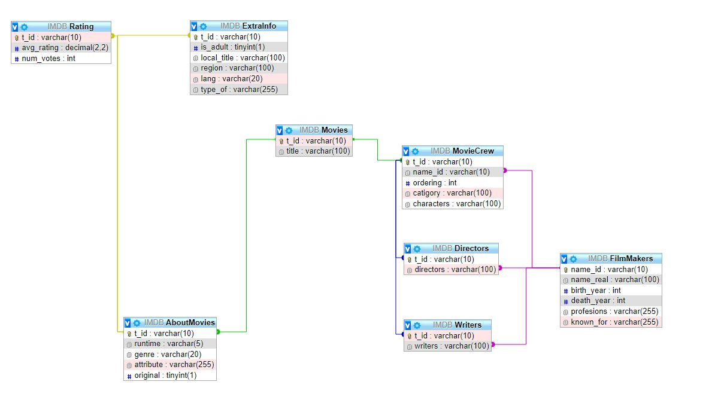

http://167.99.6.44:8002/

# What is this project:
  - This project is a database similar to that of the one that is used by http://imdb.com. What it does is have an API that is attached to the datbase of information from IMDB's website and has multiple queries that are parse the data for a users given need like that of finding all movies in a certain genre of film.

# Why is this project important:
  - This project is important in that it:
      - Could be used in a real life app that helps people find movies
      - It worked with a MASSIVE dataset so was very much like working with industry level databases
      - All the queries felt more realistic to that of what you would find in the work force since it was consumer sided
      - The queries could take up to minutes to run so cuased the conversation of how can we speed this up
      - Opened my eyes to what the real world uses on a dailybases to find all the information that we use
      - Applied the use of larger files on smaller servers and how we can use them efficiently
      - Was an introduction to having to wait for things to be loaded into MySQl since we did it a row at a time

# Where did I struggle doing this project:
  - With lots of new and confusing data types in SQL that I haven't used
  - Many new concepts around the way that we were querrying
  - Planing schemes and connections was a very hard concept for me to grasp at first 
  - Trying to make my index page for the API look nice
  - Having to read documentation and forums that had vocabulary that I was not very familiar with at first

# What issues did I enconter:
  - Some issues that I encountered were: 
    - My server could not handle all of the data with its small size
    - The fact of waiting minutes or even hours for the dataset to be loaded into MySQL
    - Lots of joins for the queries that felt jumbled at times cuasing confusion
    - A large amount of stress just in the fact of worry that my server couldnt handle the information
    - Not knowing if the API was broken of if MySQL was just being slow due to large data sizes

# What I did to combat these issues:
  The biggest thing that I did to combat all of these issues was to go over the Digital Ocean docs and figure out how my server could handle all of the problems that I was having. Also I needed to implement better ways to test my API so that I could know where and what was going on when the queries were running. I also had to read many diffrent posts on forums to understand where I was headed with this. Lastly, a big thing that I did was look at videos about datbases as a subject to furthere grasp at the knowledge surronding them. Now luckely I feel like I have started to get a good amount of knowledge about them.

# How was this project relevant to the real world:
  - This project is relevent to the real world in that renforced the idea of massive datasets and ways that we can go about implementing them 
  - It also showed me that there are deffiently better altrnatives for specific problems like mass datasets with other datbases
  - This is also very real world in that the API that is used in this is more consumer based and would be used mostly for displaying information that a user would want to find out rather then just querries to help me learn MySql

# Schema

