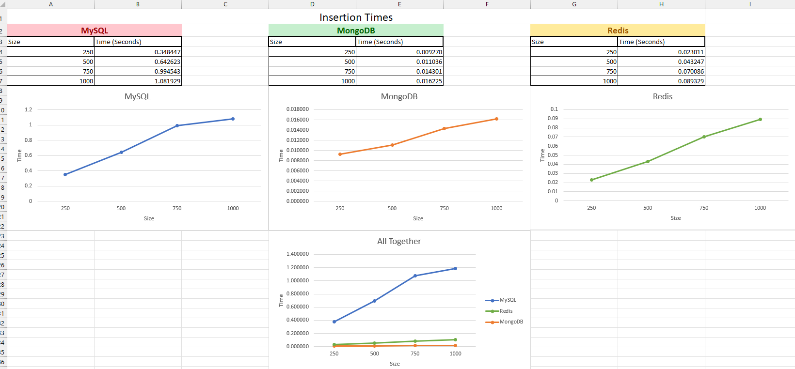
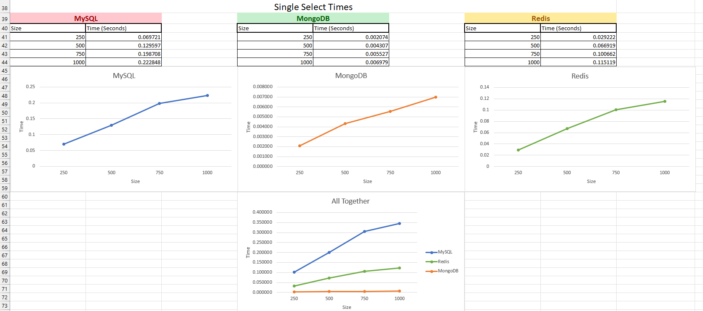
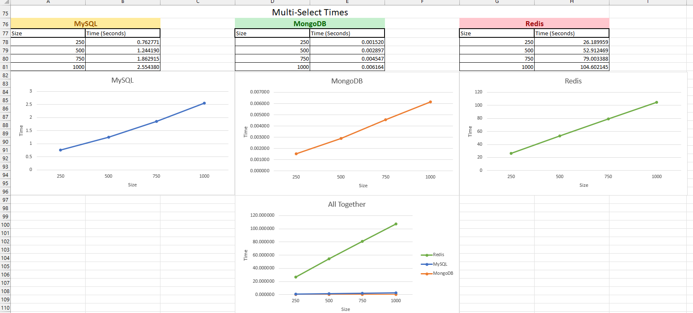
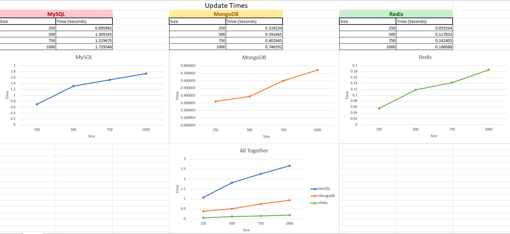
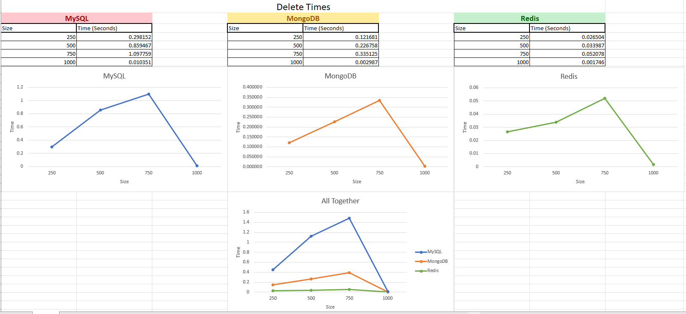

# What is this project:
  - This project is a full stack web based app using ElectronJS Wtih Vue3. This uses my backend API and MySQL database to create a reactive web based multi platform application that allows somone to edit and retrive data about Midwestern State Universities class schedule, student info, and advising forms. This would if implemented help advisors and students to use an easy and nice looking app to acess information to assist in registration. 

# Why is this project important:
  - This project is important in that it:
      - It's a full stack real application that uses real world info and application to assist in student registration
      - It uses multiple diffrent languages that interact with each other to give a nice design with a solid backend
      - Is exactly what somone in industry would be doing at a job
      - Teached me multiple new ways to design websites
      - could possibly be usable by my university
      - gives an insite into both software and websites thanks to Electron
      - Helped me appricate the field of web development with the difficulty and skill required to do so 

# Where did I struggle doing this project:
  - I struggled heavily with the css and making everything look nice
  - I struggled with having to go out of my confort zone and do front end development
  - I struggled with lots of bugs at first that took me hours to figure out what was going wrong
  - I struggled with learning how vue interacts with seperate components
  - I struggled with trying to find good recorses on how to solve many problems that I encountered

# What issues did I enconter:
  - Some issues that I encountered were: 
    - Quite bad documentation for Vue3 due to it being newer
    - Trying to make it so that the app was multiplatform
    - Trying to make the app look pretty due to my more mathmatical then artsy thinking style
    - Trying to find good resorces to help learn vue3 since it seems like most people are still using vue2
    - adapting to better API writing and more code reusability

# What I did to combat these issues:
  The biggest thing that I did to combat all of these issues was to never stop looking for more information. This sounds silly but many times I would have upwards of 20 tabs open to try and find the solution to the problems that I was facing. I also did ALOT of reading that be from forums to documentation all the way to web articles. This really helped me grasp how hard some of the things that web developers do and I think it's not as easy as people make it sound.

# How was this project relevant to the real world:
  - This project is relevent to the real world in that was a large scale project that used large amounts of data as well as many new things I needed to learn
  - It is also relevant in that it can be used to help someone in a task that can typically be pretty hard(registering for classes)
  - It is also real world in that I have designed it in a way that if you were to create a new semster there would be only limited amount of code that would need to change

# Images

